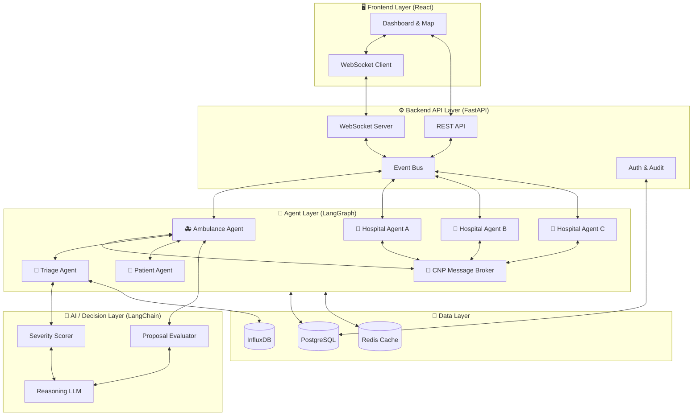
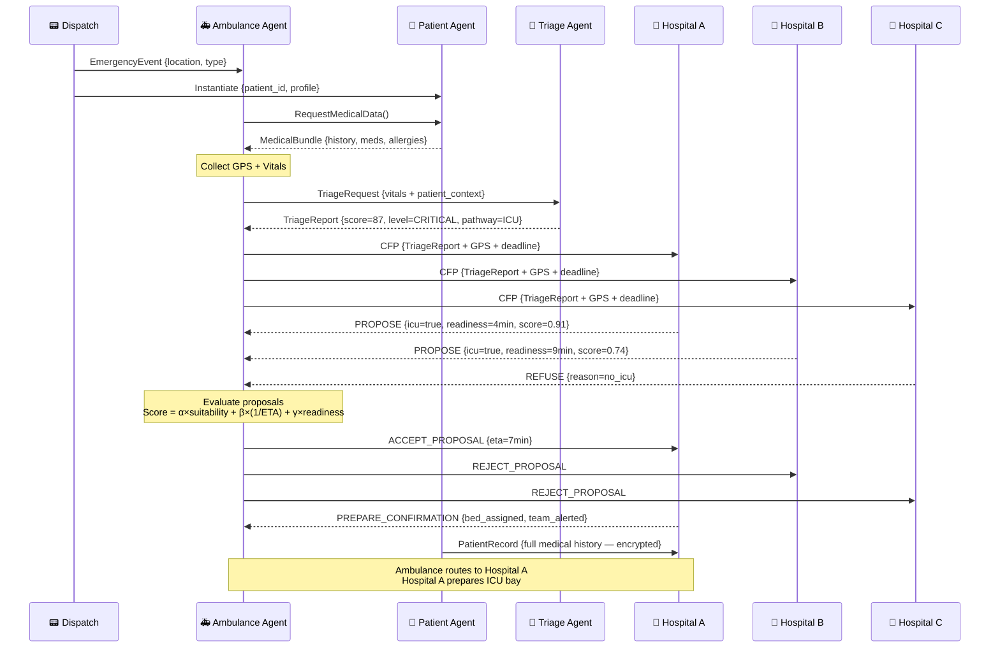
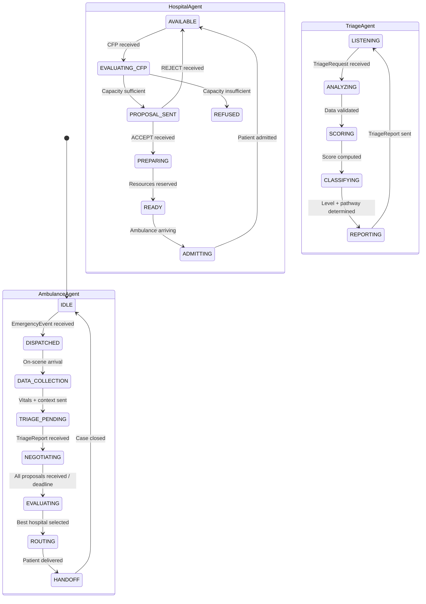
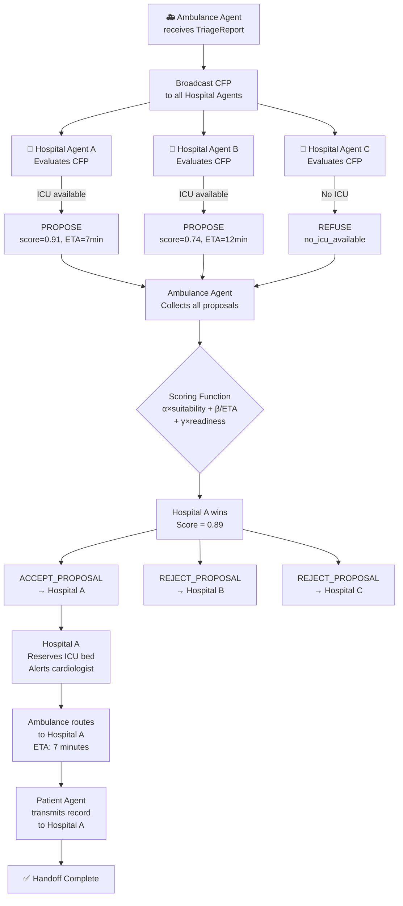

# 🚑 DECS — Distributed Emergency Coordination System

> **A Decentralized Multi-Agent System for Real-Time Emergency Healthcare Coordination in Morocco**

[](LICENSE)
[](https://python.org)
[](https://github.com/langchain-ai/langgraph)
[](https://fastapi.tiangolo.com)
[](https://reactjs.org)

---

## 📋 Table of Contents

1. [Problem Statement](#-problem-statement)
2. [Solution Overview](#-solution-overview)
3. [Agent Architecture](#-agent-architecture)
4. [System Workflow](#-system-workflow)
5. [Negotiation Protocol (CNP)](#-negotiation-protocol-cnp)
6. [System Architecture](#-system-architecture)
7. [Data Flow](#-data-flow)
8. [Diagrams](#-diagrams)
9. [Tech Stack](#-tech-stack)
10. [MVP Scope](#-mvp-scope)
11. [Future Improvements](#-future-improvements)
12. [Getting Started](#-getting-started)
13. [Contributing](#-contributing)

---

## 🚨 Problem Statement

Morocco's emergency healthcare system faces a **critical coordination gap**. When a patient requires emergency care, ambulances, hospitals, and triage personnel operate in silos — with no real-time, shared situational awareness. This leads to:

- **Misrouted ambulances** sent to hospitals that are already at full capacity
- **Delayed care decisions** due to manual phone-based coordination between dispatchers and hospitals
- **Lack of patient context** at the point of handoff — clinicians receive patients with incomplete or missing medical histories
- **No dynamic load-balancing** across hospital networks during mass-casualty events or peak periods
- **Suboptimal triage** — severity is assessed without AI-assisted classification, leading to preventable deaths

> In a country where emergency response times are already challenged by geography and infrastructure, every minute of coordination delay translates directly into preventable loss of life.

DECS is designed to eliminate this coordination gap entirely.

---

## 💡 Solution Overview

DECS is a **Distributed Multi-Agent System (MAS)** where autonomous, intelligent agents represent every key actor in the emergency response chain — the patient, the ambulance, the triage system, and each hospital. These agents communicate and negotiate with each other **in real time, without any central controller**.

### Key Principles

| Principle | Description |
|-----------|-------------|
| **Decentralization** | No single point of failure. Agents make decisions collaboratively. |
| **Autonomy** | Each agent acts on its own goals, data, and capabilities. |
| **Negotiation** | Agents use the Contract Net Protocol (CNP) to find the optimal hospital. |
| **Intelligence** | AI-powered triage scoring guides the entire coordination pipeline. |
| **Privacy** | Patient data is shared securely, with explicit consent modeled into the Patient Agent. |

### What DECS Achieves

- ✅ Real-time hospital capacity matching
- ✅ AI-driven severity scoring and ICU triage
- ✅ Automated negotiation between ambulances and hospitals
- ✅ Complete patient data portability at handoff
- ✅ Zero central dispatcher bottleneck

---

## 🤖 Agent Architecture

DECS is composed of four core agent types. Each agent has a clearly defined role, data profile, and set of responsibilities.

---

### 1. 🚑 Ambulance Agent

> **Role:** Field executor and decision enforcer

The Ambulance Agent is the primary initiator of the emergency coordination pipeline. It operates in the field, collecting patient data and driving the negotiation process to secure the most appropriate hospital destination.

**Input Data:**

| Field | Type | Description |
|-------|------|-------------|
| `gps_location` | `GeoCoordinate` | Real-time GPS coordinates of the ambulance |
| `patient_vitals` | `VitalsBundle` | Heart rate, SpO2, blood pressure, respiratory rate, GCS |
| `eta_estimates` | `Dict[hospital_id, minutes]` | Estimated travel time to each candidate hospital |
| `case_id` | `UUID` | Unique identifier for the emergency case |

**Responsibilities:**

- Receive and acknowledge an emergency dispatch event
- Initiate the Patient Agent and collect all available patient data
- Transmit aggregated case data to the Triage Agent
- Broadcast a `CALL_FOR_PROPOSALS` (CFP) message to all reachable Hospital Agents
- Evaluate hospital proposals using a weighted scoring function
- Execute the routing decision and notify the selected hospital to prepare
- Provide real-time ETA updates as it approaches the destination

**Output / Interactions:**

```
Ambulance Agent → [VitalsBundle + PatientContext] → Triage Agent
Ambulance Agent → [CFP Message + SeverityScore] → All Hospital Agents
Ambulance Agent → [ACCEPT_PROPOSAL] → Selected Hospital Agent
Ambulance Agent → [REJECT_PROPOSAL] → All Other Hospital Agents
```

---

### 2. 🏥 Hospital Agent

> **Role:** Resource manager and capacity negotiator

Each hospital in the network is represented by an autonomous Hospital Agent that monitors available resources and responds to incoming emergency requests with capacity-aware proposals.

**Input Data:**

| Field | Type | Description |
|-------|------|-------------|
| `icu_beds_available` | `int` | Number of free ICU beds |
| `general_beds_available` | `int` | Number of free general ward beds |
| `equipment_status` | `Dict[equipment_type, bool]` | Availability of key equipment (ventilators, CT, etc.) |
| `current_patient_load` | `float` | Current occupancy ratio (0.0 – 1.0) |
| `specialist_availability` | `Dict[specialty, bool]` | On-call specialist coverage |

**Responsibilities:**

- Continuously monitor and update internal resource state
- Listen for `CALL_FOR_PROPOSALS` (CFP) messages from Ambulance Agents
- Evaluate each incoming request against current capacity and required care level
- Formulate and submit a structured `PROPOSAL` if capable of accepting the case
- Send a `REFUSE` message if unable to meet the required care level
- Upon `ACCEPT_PROPOSAL`, initiate internal preparation protocols (bed assignment, staff alert, equipment readiness)
- Track case handoff and update capacity state after patient arrival

**Output / Interactions:**

```
Hospital Agent → [PROPOSAL: availability, readiness_time, suitability_score] → Ambulance Agent
Hospital Agent → [REFUSE] → Ambulance Agent (if capacity insufficient)
Hospital Agent → [PREPARE_CONFIRMATION] → Ambulance Agent (after acceptance)
```

**Proposal Structure:**

```json
{
  "hospital_id": "CHU_OUJDA_01",
  "hospital_name": "CHU Mohamed VI Oujda",
  "icu_available": true,
  "estimated_readiness_minutes": 4,
  "distance_km": 3.2,
  "suitability_score": 0.91,
  "accepts_case": true
}
```

---

### 3. 🧠 Triage Agent

> **Role:** Intelligent decision-support engine

The Triage Agent is the AI core of the system. It receives patient data from the Ambulance Agent and computes a structured severity assessment that drives all downstream hospital negotiations.

**Input Data:**

| Field | Type | Description |
|-------|------|-------------|
| `symptoms` | `List[str]` | Reported or observed symptoms |
| `vitals` | `VitalsBundle` | Current physiological measurements |
| `medical_history` | `MedicalHistory` | Chronic conditions, allergies, medications |
| `age` | `int` | Patient age |
| `mechanism_of_injury` | `str` | Trauma type or chief complaint |

**Responsibilities:**

- Compute a **severity score** (0–100) using a weighted clinical model
- Classify the case into one of three urgency levels: `NORMAL`, `URGENT`, or `CRITICAL`
- Determine required care pathway: `ICU` or `GENERAL`
- Flag specific specialist requirements (e.g., cardiologist, neurosurgeon)
- Generate a structured `TriageReport` consumed by the Ambulance Agent for the CFP broadcast
- Provide explainable reasoning for every classification decision

**Output:**

```json
{
  "severity_score": 87,
  "urgency_level": "CRITICAL",
  "care_pathway": "ICU",
  "specialist_required": ["cardiologist"],
  "triage_reasoning": "Patient presents with acute chest pain, SpO2 < 90%, and hypotension. Suspected STEMI. Immediate cath lab required.",
  "timestamp": "2025-06-14T14:32:11Z"
}
```

**Severity Classification Scale:**

| Score Range | Urgency Level | Care Pathway |
|-------------|--------------|--------------|
| 0 – 30 | `NORMAL` | General Ward |
| 31 – 65 | `URGENT` | General Ward or Specialist |
| 66 – 100 | `CRITICAL` | ICU / Immediate Intervention |

---

### 4. 👤 Patient Agent

> **Role:** Digital identity and medical data custodian

The Patient Agent is instantiated at the moment an emergency is triggered. It acts as a secure, consent-aware repository of the patient's identity and medical history throughout the care episode.

**Input Data:**

| Field | Type | Description |
|-------|------|-------------|
| `patient_id` | `UUID` | National health ID or generated UUID |
| `personal_info` | `PersonalProfile` | Name, age, blood type, emergency contacts |
| `medical_history` | `MedicalHistory` | Past conditions, surgeries, hospitalizations |
| `chronic_diseases` | `List[str]` | Diabetes, hypertension, cardiac conditions, etc. |
| `current_medications` | `List[Medication]` | Active prescriptions |
| `allergies` | `List[str]` | Known drug and environmental allergies |
| `consent_status` | `bool` | Whether the patient has consented to data sharing |

**Responsibilities:**

- Provide structured medical context to the Triage Agent and receiving Hospital Agent
- Enforce data-sharing consent rules — no data leaves the agent without authorization
- Maintain a cryptographically signed data bundle to prevent tampering
- Flag contraindications relevant to proposed treatments at the hospital
- Ensure data is transferred securely and completely at the point of hospital handoff

**Output / Interactions:**

```
Patient Agent → [ConsentedMedicalBundle] → Triage Agent
Patient Agent → [FullPatientRecord] → Selected Hospital Agent (post-acceptance)
```

---

## 🔄 System Workflow

The DECS coordination pipeline follows a strict, event-driven sequence of 10 steps from emergency detection to patient delivery.

### Step-by-Step Process

```
┌─────────────────────────────────────────────────────────────────┐
│  STEP 1: Emergency Event Triggered                              │
│  Source: 911 call, IoT sensor, bystander report, or auto-alert  │
│  Output: EmergencyEvent { location, type, timestamp }           │
└────────────────────────────┬────────────────────────────────────┘
                             ▼
┌─────────────────────────────────────────────────────────────────┐
│  STEP 2: Agent Instantiation                                    │
│  System spawns:                                                 │
│    - PatientAgent (with available ID or anonymous profile)      │
│    - AmbulanceAgent (nearest available unit dispatched)         │
└────────────────────────────┬────────────────────────────────────┘
                             ▼
┌─────────────────────────────────────────────────────────────────┐
│  STEP 3: Data Collection                                        │
│  AmbulanceAgent collects:                                       │
│    - Patient vitals (on-site or via IoT wearables)              │
│    - GPS location + ETA map                                     │
│    - PatientAgent provides: history, medications, allergies     │
└────────────────────────────┬────────────────────────────────────┘
                             ▼
┌─────────────────────────────────────────────────────────────────┐
│  STEP 4: Data Transmission to Triage Agent                      │
│  AmbulanceAgent sends: VitalsBundle + PatientContext            │
│  Message Type: TRIAGE_REQUEST                                   │
└────────────────────────────┬────────────────────────────────────┘
                             ▼
┌─────────────────────────────────────────────────────────────────┐
│  STEP 5: Severity Analysis                                      │
│  TriageAgent computes:                                          │
│    - Severity score (0–100)                                     │
│    - Urgency classification (NORMAL / URGENT / CRITICAL)        │
│    - Care pathway determination (ICU or General)                │
│    - Specialist requirements                                    │
│  Output: TriageReport                                           │
└────────────────────────────┬────────────────────────────────────┘
                             ▼
┌─────────────────────────────────────────────────────────────────┐
│  STEP 6: CFP Broadcast to Hospital Agents                       │
│  AmbulanceAgent broadcasts CALL_FOR_PROPOSALS containing:       │
│    - TriageReport (severity, care pathway, specialists)         │
│    - GPS location                                               │
│    - Deadline for proposal submission                           │
└────────────────────────────┬────────────────────────────────────┘
                             ▼
┌─────────────────────────────────────────────────────────────────┐
│  STEP 7: Negotiation Phase (CNP)                                │
│  Each HospitalAgent:                                            │
│    - Evaluates its own capacity vs. requested care requirements  │
│    - Submits PROPOSAL or REFUSE within the deadline             │
│  Proposals include: availability, readiness time, suitability  │
└────────────────────────────┬────────────────────────────────────┘
                             ▼
┌─────────────────────────────────────────────────────────────────┐
│  STEP 8: Proposal Evaluation                                    │
│  AmbulanceAgent scores each proposal using:                     │
│    W1 × suitability + W2 × (1/ETA) + W3 × readiness_score      │
│  Weights adapted to urgency level                               │
└────────────────────────────┬────────────────────────────────────┘
                             ▼
┌─────────────────────────────────────────────────────────────────┐
│  STEP 9: Best Hospital Selection                                │
│  AmbulanceAgent sends:                                          │
│    - ACCEPT_PROPOSAL → Winning HospitalAgent                    │
│    - REJECT_PROPOSAL → All other HospitalAgents                 │
│  HospitalAgent confirms preparation and reserves resources      │
└────────────────────────────┬────────────────────────────────────┘
                             ▼
┌─────────────────────────────────────────────────────────────────┐
│  STEP 10: Execution                                             │
│  AmbulanceAgent: initiates GPS-guided routing to hospital       │
│  HospitalAgent: prepares bed, alerts staff, readies equipment   │
│  PatientAgent: transmits full medical record to hospital        │
│  System logs: complete coordination audit trail                 │
└─────────────────────────────────────────────────────────────────┘
```

---

## 🤝 Negotiation Protocol (CNP)

DECS implements the **Contract Net Protocol (CNP)**, a well-established distributed AI negotiation standard originally proposed by Reid Smith (1980) and formalized in FIPA ACL.

### Protocol Phases

#### Phase 1 — Task Announcement (CALL_FOR_PROPOSALS)

The Ambulance Agent broadcasts a CFP to all Hospital Agents within range. The CFP contains the full requirements of the case.

```json
{
  "performative": "CALL_FOR_PROPOSALS",
  "sender": "ambulance_agent_07",
  "receivers": ["hospital_oujda_01", "hospital_nador_01", "hospital_berkane_01"],
  "content": {
    "case_id": "EMG-2025-8821",
    "severity_score": 87,
    "care_pathway": "ICU",
    "specialist_required": ["cardiologist"],
    "ambulance_gps": { "lat": 34.6805, "lng": -1.9071 },
    "proposal_deadline": "2025-06-14T14:32:41Z"
  }
}
```

#### Phase 2 — Proposal Submission

Each Hospital Agent evaluates the request and responds with either a `PROPOSE` or a `REFUSE`.

```json
{
  "performative": "PROPOSE",
  "sender": "hospital_oujda_01",
  "receiver": "ambulance_agent_07",
  "content": {
    "icu_beds_available": 3,
    "cardiologist_on_call": true,
    "estimated_readiness_minutes": 4,
    "distance_km": 3.2,
    "suitability_score": 0.91
  }
}
```

#### Phase 3 — Selection and Award

The Ambulance Agent evaluates all proposals using its scoring function and awards the contract to the best match.

```json
{
  "performative": "ACCEPT_PROPOSAL",
  "sender": "ambulance_agent_07",
  "receiver": "hospital_oujda_01",
  "content": {
    "case_id": "EMG-2025-8821",
    "eta_minutes": 7,
    "confirmation_required": true
  }
}
```

### Proposal Scoring Function

```
Score(h) = α × Suitability(h)
         + β × (1 / ETA(h))
         + γ × ReadinessScore(h)
         + δ × CapacityScore(h)

Where:
  α + β + γ + δ = 1.0

  For CRITICAL cases:  α=0.35, β=0.35, γ=0.20, δ=0.10
  For URGENT cases:    α=0.30, β=0.30, γ=0.25, δ=0.15
  For NORMAL cases:    α=0.25, β=0.20, γ=0.30, δ=0.25
```

---

## 🏗️ System Architecture

### High-Level Architecture Description

DECS is designed around three core architectural principles:

**1. Multi-Agent System (MAS)**
The system is composed of autonomous agents, each encapsulating its own state, decision logic, and communication interface. Agents interact via asynchronous message passing using FIPA ACL-compliant performatives (CFP, PROPOSE, ACCEPT, REJECT, INFORM).

**2. Event-Driven Architecture**
All system activity is triggered by events — an emergency dispatch, a vital sign update, a hospital capacity change. This ensures the system is always reactive to real-world state changes with minimal latency.

**3. Decentralized Decision-Making**
There is no central orchestrator or dispatcher. All routing and care decisions emerge from agent-to-agent negotiation. This eliminates single points of failure and enables the system to scale horizontally as more hospitals and ambulances join the network.

---

### System Layers

```
┌──────────────────────────────────────────────────────────┐
│                   FRONTEND LAYER                         │
│  React Dashboard • Real-time Map • Agent Status Panels   │
│  Coordinator View • Alert Management • Audit Logs        │
└──────────────────────────┬───────────────────────────────┘
                           │ REST / WebSocket
┌──────────────────────────▼───────────────────────────────┐
│                  BACKEND API LAYER                        │
│  FastAPI • WebSocket Server • Event Bus                  │
│  Authentication • Rate Limiting • Audit Logger           │
└──────────────────────────┬───────────────────────────────┘
                           │ Internal API
┌──────────────────────────▼───────────────────────────────┐
│                   AGENT LAYER                             │
│  AmbulanceAgent • HospitalAgent • TriageAgent            │
│  PatientAgent • Message Broker (CNP Engine)              │
└──────────────────────────┬───────────────────────────────┘
                           │ LLM / Decision Calls
┌──────────────────────────▼───────────────────────────────┐
│                AI / DECISION LAYER                        │
│  LangChain Chains • LangGraph State Machines             │
│  Severity Scoring • Proposal Evaluation • Reasoning LLM  │
└──────────────────────────┬───────────────────────────────┘
                           │ Read / Write
┌──────────────────────────▼───────────────────────────────┐
│                    DATA LAYER                             │
│  PostgreSQL (Cases, Agents) • Redis (Live State / Cache) │
│  InfluxDB (Vitals Time-Series) • S3 (Audit Logs)         │
└──────────────────────────────────────────────────────────┘
```

---

## 🔄 Data Flow

### Complete Data Flow Table

| Step | From | To | Data Passed | Format |
|------|------|----|-------------|--------|
| 1 | Dispatch Event | AmbulanceAgent + PatientAgent | `EmergencyEvent` | JSON Event |
| 2 | PatientAgent | AmbulanceAgent | `PatientContext` (history, meds, allergies) | `MedicalBundle` |
| 3 | AmbulanceAgent (sensors) | AmbulanceAgent (internal) | GPS, vitals, ETA map | `VitalsBundle` |
| 4 | AmbulanceAgent | TriageAgent | `VitalsBundle` + `PatientContext` | `TriageRequest` |
| 5 | TriageAgent | AmbulanceAgent | `TriageReport` (score, level, pathway) | `TriageReport` |
| 6 | AmbulanceAgent | All HospitalAgents | `TriageReport` + GPS + deadline | `CFP Message` |
| 7 | Each HospitalAgent | AmbulanceAgent | Capacity, readiness, suitability | `PROPOSE` or `REFUSE` |
| 8 | AmbulanceAgent (internal) | — | Proposal scoring computation | Scoring function |
| 9a | AmbulanceAgent | Winning HospitalAgent | `ACCEPT_PROPOSAL` + ETA | ACL Message |
| 9b | AmbulanceAgent | Losing HospitalAgents | `REJECT_PROPOSAL` | ACL Message |
| 10 | PatientAgent | Winning HospitalAgent | Full `PatientRecord` | Encrypted bundle |
| 11 | HospitalAgent | Internal systems | Bed reservation, staff alert | Internal command |

### Event Flow Notation

```
EmergencyEvent
    → AmbulanceAgent [GPS + Vitals]
        → TriageAgent [VitalsBundle + PatientContext]
            → TriageReport [score=87, level=CRITICAL, pathway=ICU]
        → Hospital_01 [CFP + TriageReport] → PROPOSE {suitability=0.91, eta=7min}
        → Hospital_02 [CFP + TriageReport] → PROPOSE {suitability=0.74, eta=12min}
        → Hospital_03 [CFP + TriageReport] → REFUSE {reason=no_icu_available}
            → ACCEPT Hospital_01
            → REJECT Hospital_02, Hospital_03
    → PatientAgent → [MedicalRecord] → Hospital_01
    → AmbulanceAgent → routes to Hospital_01 [ETA: 7 min]
    → Hospital_01 → prepares ICU bed, alerts cardiologist
```

---

## 📊 Diagrams

### 1. High-Level Architecture Diagram



---

### 2. Data Flow Diagram



---

### 3. Agent Interaction & State Diagram



---

### 4. CNP Negotiation Flow



---

## 🛠️ Tech Stack

### Core Technologies

| Layer | Technology | Purpose |
|-------|-----------|---------|
| **Agent Framework** | LangGraph | Agent state machines, lifecycle management, and graph-based workflow orchestration |
| **AI Chains** | LangChain | Severity scoring chains, proposal evaluation chains, LLM reasoning wrappers |
| **LLM Backend** | GPT-4o / Claude 3.5 | Natural language triage reasoning and explainability |
| **Backend API** | FastAPI (Python) | RESTful endpoints, WebSocket server, event bus |
| **Frontend** | React + TypeScript | Real-time dashboard, map visualization, agent monitoring |
| **Map Rendering** | Leaflet.js / Mapbox GL | Live ambulance tracking and hospital locations |
| **Message Broker** | Redis Pub/Sub | Real-time inter-agent message passing |
| **Primary Database** | PostgreSQL | Cases, agents, hospitals, audit logs |
| **Cache & State** | Redis | Live agent states, session management |
| **Time-Series DB** | InfluxDB | Patient vitals streaming and monitoring |
| **Containerization** | Docker + Docker Compose | Service orchestration and deployment |
| **Communication** | WebSocket | Frontend ↔ Backend real-time updates |

### Key Libraries

```
# Python Backend
langchain==0.3.x
langgraph==0.2.x
fastapi==0.115.x
uvicorn==0.32.x
sqlalchemy==2.0.x
redis==5.0.x
pydantic==2.x
httpx==0.27.x

# Frontend
react==18.x
typescript==5.x
leaflet==1.9.x
socket.io-client==4.x
tailwindcss==3.x
recharts==2.x
```

---

## 🎯 MVP Scope

The Minimum Viable Product focuses on demonstrating the full coordination pipeline end-to-end with a simulated environment.

### In-Scope for MVP

- [x] **4-Agent System**: Full implementation of Ambulance, Hospital, Triage, and Patient agents
- [x] **CNP Negotiation Engine**: Complete Contract Net Protocol with CFP → PROPOSE → ACCEPT/REJECT cycle
- [x] **AI Triage Scoring**: LangChain-powered severity classifier with explainable output
- [x] **Simulation Mode**: Pre-configured emergency scenarios for demonstration
- [x] **REST API**: Full CRUD + event endpoints via FastAPI
- [x] **Real-Time Dashboard**: React frontend with WebSocket updates showing live agent states
- [x] **Map View**: Ambulance GPS simulation and hospital markers on Leaflet.js
- [x] **Audit Logging**: Complete record of every agent decision and message exchange
- [x] **3+ Hospital Simulation**: Multi-hospital negotiation with realistic capacity profiles
- [x] **Patient Data Privacy**: Consent-gated data sharing modeled in Patient Agent

### Out-of-Scope for MVP

- [ ] Real GPS integration (replaced by simulation)
- [ ] EHR system integration (FHIR interface)
- [ ] SMS/call notification to family
- [ ] Mobile app for ambulance crews
- [ ] Production-grade authentication and HIPAA/GDPR compliance audit

---

## 🚀 Future Improvements

### Phase 2 — System Hardening

| Feature | Description |
|---------|-------------|
| **FHIR Integration** | Connect PatientAgent to national EHR systems via HL7 FHIR R4 |
| **Real GPS/IoT** | Integrate with ambulance AVL systems and medical IoT wearables |
| **Predictive Load Balancing** | Use historical patterns to predict hospital capacity before crises peak |
| **Multi-Ambulance Coordination** | Enable coordination across fleets for mass-casualty events |

### Phase 3 — Intelligence Upgrades

| Feature | Description |
|---------|-------------|
| **Reinforcement Learning** | Train routing agents on historical outcome data to continuously improve decisions |
| **Federated Learning** | Allow hospitals to collaboratively improve the triage model without sharing raw patient data |
| **Explainability Dashboard** | Full reasoning trace for every AI decision, reviewable by clinicians |
| **Outcome Feedback Loop** | Post-discharge outcome data fed back to improve triage accuracy |

### Phase 4 — Scale & Integration

| Feature | Description |
|---------|-------------|
| **National SAMU Integration** | Interface with Morocco's national emergency dispatch system |
| **Cross-Border Coordination** | Protocol extension for coordination with hospitals in neighboring regions |
| **Mobile Crew App** | React Native app for paramedic teams with offline-first capability |
| **Regulatory Compliance** | Full audit trail aligned with Moroccan health data regulations |

---

<div align="center">

**DECS — Distributed Emergency Coordination System**

*Decentralized. Intelligent. Life-saving.*

</div>
